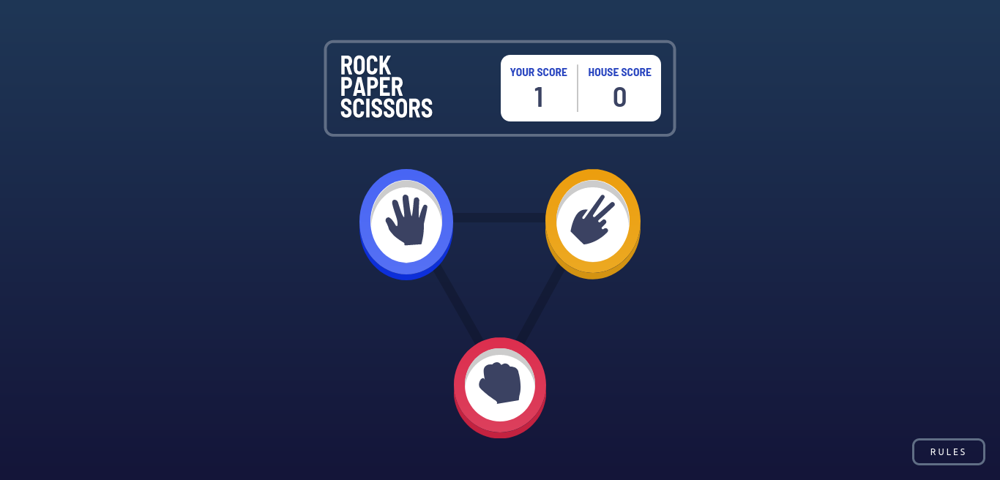

# Frontend Mentor - Rock, Paper, Scissors solution

This is a solution to the [Rock, Paper, Scissors challenge on Frontend Mentor](https://www.frontendmentor.io/challenges/rock-paper-scissors-game-pTgwgvgH). Frontend Mentor challenges help you improve your coding skills by building realistic projects.

## Table of contents

- [Overview](#overview)
  - [The challenge](#the-challenge)
  - [Screenshot](#screenshot)
  - [Links](#links)
- [My process](#my-process)
  - [Built with](#built-with)
  - [Useful resources](#useful-resources)
- [Author](#author)
- [Acknowledgments](#acknowledgments)

## Overview

### The challenge

Users should be able to:

- View the optimal layout for the game depending on their device's screen size
- Play Rock, Paper, Scissors against the computer
- Maintain the state of the score after refreshing the browser _(optional)_
- **Bonus**: Play Rock, Paper, Scissors, Lizard, Spock against the computer _(optional)_

### Screenshot

### Links

- Live Site URL: [Github](https://lio-n.github.io/FM-rock-paper-scissors/)

## My process

### Built with

- Web components
- Typescript
- Mobile-first workflow

### Useful resources

- [Parcel](https://www.npmjs.com/package/parcel)
- [@vaadin/router](https://www.npmjs.com/package/@vaadin/router)

## Author

- Frontend Mentor - [@Lio-n](https://www.frontendmentor.io/profile/Lio-n)
- Twitter - [@_Lio_n_](https://twitter.com/_Lio_n_)
- Linkedin - [Leonardo Fontan](https://www.linkedin.com/in/leonardo-fontan-543b38205/)

## Acknowledgments

I did this challenge on my own, but everything I learned about Frontend, it was thanks to [Apx School](https://apx.school/carreras/dwf)
